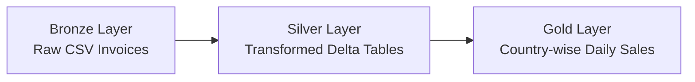

# Sales Delta Pipeline  

## Overview  
Pipeline to ingest and transform sales invoices into Delta tables (silver), then aggregate daily country-wise sales into gold. Supports both full and incremental loads with merge logic for efficient updates.  

## Architecture  
- **Bronze**: Raw CSV invoices (historic + incremental).  
- **Silver**: Transformed and partitioned Delta tables (cleaned invoices).  
- **Gold**: Aggregated country-wise daily sales.  

## Pipeline Flow  


## Notebooks / Scripts  
- `sales_ingestion_delta.py` → Reads invoices from bronze, transforms, and writes/merges into silver.  
- `02_sales_analysis_delta.py` → Aggregates invoices from silver and loads/merges into gold.  

## Parameters  
- `p_load_type` → `"initial"` for full load, `"incremental"` for delta load.  
- `p_file_date` → Used in incremental load to fetch the correct invoice file.  

## Execution Flow  
1. Run **sales_ingestion_delta** with the desired load type and file date.  
2. For incremental loads, transformed data is exposed as a global temp view for downstream analysis.  
3. Run **sales_analysis_delta** to aggregate and merge results into gold tables.  

## Outputs  
- **Silver Table**: `/Volumes/.../sales/silver/sales-delta/invoices/`  
- **Gold Table**: `sales_delta_db.country_wise_daily_sales`  

## Example Queries  
```sql
SELECT country, invoice_date, total_sales
FROM sales_delta_db.country_wise_daily_sales
WHERE country = 'United Kingdom'
  AND invoice_year = 2022
ORDER BY invoice_date;
```  
